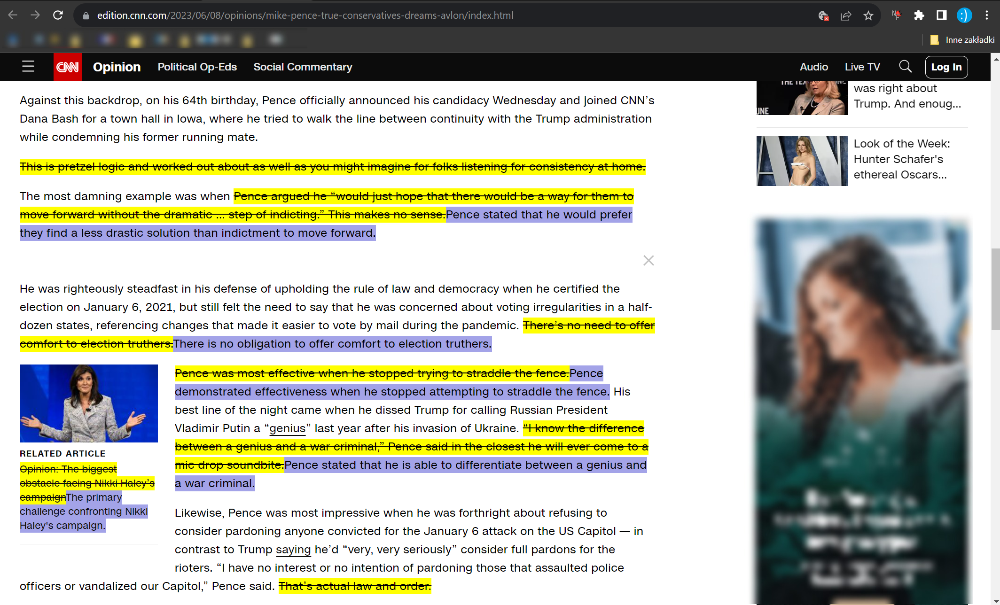
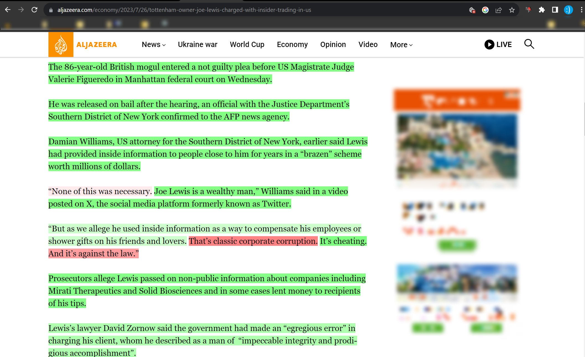
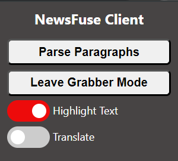

# NewsFuse - AI powered detector of biased/opinionated content in news articles


## What is NewsFuse?

**NewsFuse** is a chrome extension and Flask application that parse the news article for opinionated sentences and classifies them as biased or not biased as to help the reader to not be influenced by the author's opinion.

It highlights the result as background color of the sentence - green for unbiased and red for biased.

Additionally it allows to enter a _translation_ mode that tries to deopinionate the article by replacing the biased sentences (highlighted in yellow) with their unbiased counterparts (highlighted in purple).

## Examples

### [CNN-opinion article](https://edition.cnn.com/2023/06/08/opinions/mike-pence-true-conservatives-dreams-avlon/index.html) - bias highlight


As this is an opinion article, it is expected to have a lot of biased sentences. The extension highlights them in red. The green highlights are the sentences that are not biased - e.g.

_"Against this backdrop, on his 64th birthday, Pence officially announced his candidacy Wednesday and joined CNN’s Dana Bash for a town hall in Iowa, where he tried to walk the line between continuity with the Trump administration while condemning his former running mate."_

mostly states facts and not opinion (although the last part might be considered opinionated).

On the contrary the sentence

_This is pretzel logic and worked out about as well as you might imagine for folks listening for consistency at home._

is clearly opinionated and is highlighted in red.

### [CNN-opinion article](https://edition.cnn.com/2023/06/08/opinions/mike-pence-true-conservatives-dreams-avlon/index.html) - translation



Translation only modifies the sentences that are highlighted in red - e.g. the aformentioned sentence _This pretzel logic (...)_ has been removed in its entirety as it has no factual value. Whilst a sentence

_Pence was most effective when he stopped trying to straddle the fence._

has been rewritten to more objective

_Pence demonstrated effectiveness when he stopped attempting to straddle the fence._

### [Al-jazeera news article](https://www.aljazeera.com/economy/2023/7/26/tottenham-owner-joe-lewis-charged-with-insider-trading-in-us) - bias highlight



Here the extension is tested on purely factual news article. As expected, most of the article is highlighted as unbiased - with the exception being direct quotes which are not yet being excluded from the parsing process.

### [Al-jazeera news article](https://www.aljazeera.com/economy/2023/7/26/tottenham-owner-joe-lewis-charged-with-insider-trading-in-us) - translation


The quotes detected as biased have been removed in their entirety.

## How does it work?

### Chrome extension

The chrome extension is a simple javascript application that parses the DOM of the current page and sends the text to the Flask application for processing. It then receives the result and highlights the biased sentences.

### Flask application

The Flask application is a simple REST API that receives the text corpus from the chrome extension, splits it to sentences with [nltk](https://www.nltk.org/) and sends it to pretrained BERT classifier.

The classifier is a simple transformer with a linear layer on top of it, trained on [MBIC](https://www.kaggle.com/datasets/timospinde/mbic-a-media-bias-annotation-dataset) dataset. It uses [preprocessing layer](https://tfhub.dev/tensorflow/bert_en_uncased_preprocess/3) and small [BERT model](https://tfhub.dev/tensorflow/small_bert/bert_en_uncased_L-8_H-128_A-2/2) from [TensorFlow Hub](https://tfhub.dev/).

After the classification, the Flask application sends the result back to the chrome extension in form of sentence-classification pairs.

The translation mode is implemented by replacing the biased sentences with their unbiased counterparts using OpenAI's [GPT-3.5-turbo](https://openai.com/blog/better-language-models/) model via API,yet due to restrictions of the model the quality of translations varies heavily.

The flask app is intended to be deployed as Azure Function, yet it can be run locally as well.

## Controls



The extension has the following controls:

- **Parse Paragraphs** - finds all paragraphs in the current page and parses them for biased sentences.
- **Enter/Exit Grabber Mode** - allows to select a text on the page and parse it for biased sentences.
- **Hide/Show Highlights** - hides/shows the highlights of biased/translated sentences.
- **Translate** - changes the mode to translation mode. In this mode, the biased sentences are replaced with their unbiased counterparts.

## Limitations

- The extension is not yet published on Chrome Web Store, so it has to be installed manually and the Flask application has to be run locally.
- The extension does not yet support direct quotes, so they are being parsed as any other sentence.
- Reported speech is sometimes being incorrectly classified as biased.
- Highlighting engine has some issues with highlighting sentences that contain HTML tags and might omit some of the sentences or highlight them incorrectly.

## Running locally

### Prerequisites

- Python 3.10+
- Azure Functions Core Tools
- Azurite

### Steps

1. Clone the repository
   ```bash
    git clone https://github.com/Tremirre/NewsFuse.git
   ```
2. Open the repository in VS Code
   ```bash
    cd NewsFuse
    code .
   ```
3. Create and activate virtual environment
   ```bash
    python -m venv .venv
    .venv\Scripts\activate
   ```
4. Install dependencies
   ```bash
    pip install -r requirements.txt
   ```
5. Run Azurite

   ```bash
    azurite --silent
   ```

6. Run the Flask application

   ```bash
    func host start
   ```

7. Add the extension to Chrome

   - Open Chrome
   - Go to `chrome://extensions/`
   - Enable `Developer mode`
   - Click `Load unpacked`
   - Select `NewsFuse/newsfuse-ext` folder

8. Open any news article and click `Parse Paragraphs` button

9. Enjoy!
